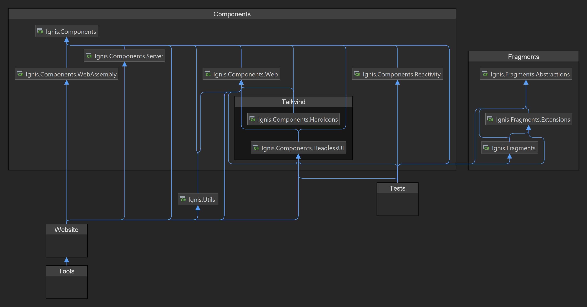

# Contributing

Thanks for your interest in contributing! Please take a moment to review this document in order to make the contribution
process easy and effective for everyone involved.

## Pull requests

**Please ask first before starting work on any significant changes/features!**

It is never a fun experience to put a lot of work into a pull request only to have it rejected because it doesn't fit
with the project's goals or because someone else is already working on it.

## Getting started

### Prerequisites

- [Git](https://git-scm.com/)
- [Node.js](https://nodejs.org/) (version 18.x)
- [.NET SDK](https://dotnet.microsoft.com/download) (version 7.0.x)

### Project setup

1. Fork and clone the repository
2. Run `npm install` to install dependencies
3. Run `dotnet build ./Ignis.sln -c Release` to build the project

This should be all you need to get started. If you run into any issues, please let us know by opening an issue.

#### Generated content

Both the `Ignis.Components.HeroIcons` and the `Ignis.Website` projects contain generated content.

The `Ignis.Components.HeroIcons` project contains the generated C# code for the HeroIcons. This code is generated from
the official [heroicons repository](https://github.com/tailwindlabs/heroicons) , which you can run with the following
command:

```shell
dotnet run --project ./tools/Ignis.Components.HeroIcons.Generator
```

The `Ignis.Website` project contains the generated documentation for the Ignis repository. This documentation is
generated from the markdown files in the [docs](docs) directory and the JSON output generated
using [doki](https://github.com/DavidVollmers/doki).

You can generate the [doki](https://github.com/DavidVollmers/doki) documentation with the following command:

```shell
dotnet doki g
```

Then you can generate the website documentation with the following command:

```shell
dotnet run --project ./tools/Ignis.Website.Generator
```

## Coding standards

We use [Husky.Net](https://github.com/alirezanet/Husky.Net) to enforce coding standards. As long as you followed the
setup instructions above, you should be good to go.

## Running tests

Ignis uses [xUnit](https://xunit.net/) for unit testing. You can run the tests with the following command:

```shell
dotnet test Ignis.sln
```

**Please ensure that the tests are passing when submitting a pull request. If you're adding new features to Headless UI,
please include tests!**

## Project structure



The above diagram shows the project structure. Ignis contains multiple packages for different purposes. You can read
more about them in the [documentation](https://ignis.dvolper.dev/docs/components/packages).
