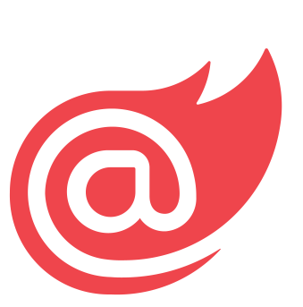
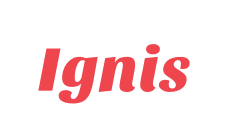

     
    
     
    
     

The Blazor framework for building modern web applications.

## Features

- **Component-based:** Ignis is a component-based framework that allows you to build your application using components.
- **Blazor:** Ignis is built on top of Blazor, which means that you can use all of the features that Blazor has to
  offer.
- **Open-source:** Ignis is open-source and free to use. You can use it for both personal and commercial projects.
- **Lightweight:** Ignis is lightweight and does not have any dependencies other than Blazor.
- **Integration:** You can use Ignis to build your application from scratch or use it to extend your existing
  application.
- **Control:** Ignis gives you full control over your application rendering. You can decide when to render your
  components or rely on the Ignis reactivity system.
- **HeadlessUI:** Ignis supports [Headless UI](https://headlessui.com). Headless UI is a set of unstyled, fully
  accessible UI components.

## Getting Started

Visit the official website for guides and documentation: https://ignis.dvolper.dev

---

## License

This project is licensed under the [MIT](LICENSE.txt) license.
