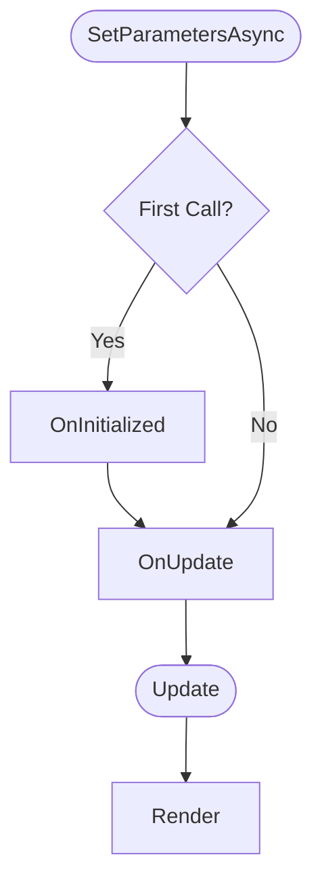

---
order: 1
title: Component Lifecycle
category: Components
permalink: /components/lifecycle
---

Ignis components have a lifecycle that is different to that of a Razor component. This is done to allow for more control
over the rendering process.

The following flowchart shows the lifecycle of the default component in Ignis. You can adopt this lifecycle for your own
component by inheriting from `IgnisComponentBase`. There is also an `IgnisAsyncComponentBase` that you can inherit from
if you need to perform asynchronous operations in your component.



You **should** always call the `Update` method when you want to update the component outside of this lifecycle. This
will trigger a re-render of the component.

You can read more about when parameters are
set [here](https://learn.microsoft.com/en-us/aspnet/core/blazor/components/lifecycle?view=aspnetcore-7.0#when-parameters-are-set-setparametersasync).

## Additional lifecycle methods

Contrary to Razor components, Ignis components do not offer an `OnAfterRender` method, nor do they automatically update
on event callbacks.

You can still add this functionality to your component by implementing the `IHandleAfterRender` interface or
the `IHandleEvent` interface.

```csharp
public class MyComponent : IgnisComponentBase, IHandleAfterRender, IHandleEvent
{
    public Task OnAfterRenderAsync()
    {
        // This will be called after the component has been rendered.
    }

    public Task HandleEventAsync(EventCallbackWorkItem item, object? arg)
    {
        // This will be called when an event is triggered.
    }
}
```

## `ServerPrerendered` rendering mode

Contrary to Razor components, Ignis component's lifecycle methods are not called twice when the rendering mode is set
to `ServerPrerendered`.

If you still want to prerender your Ignis components, you can use the `PrerenderAttribute` to enable prerendering:

```cshtml
@attribute [Prerender]
@inherits IgnisComponentBase

<div>
    This content will be prerendered.
</div>
```

The prerender cycle will happen without calling the `OnInitialized` and `OnUpdate` methods. This can be useful if you
want to render loading states, placeholders or search engine relevant content.
